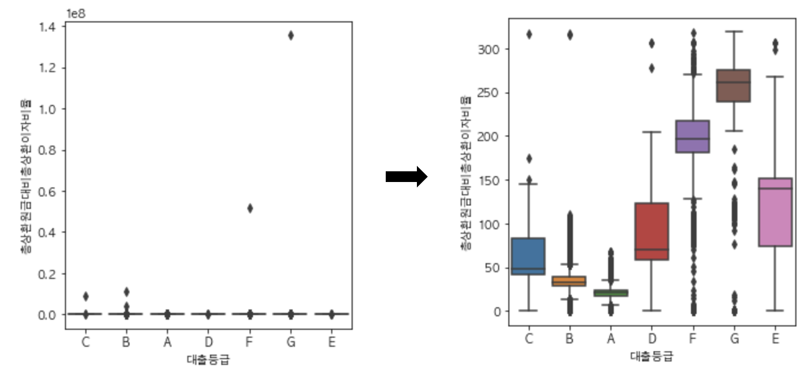
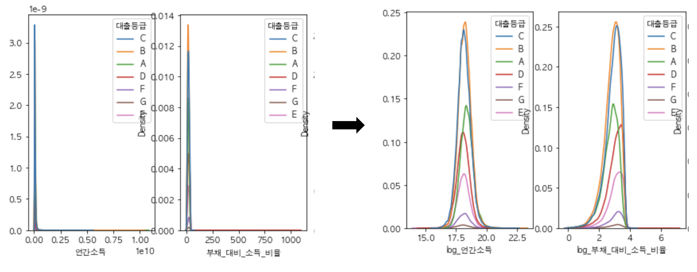
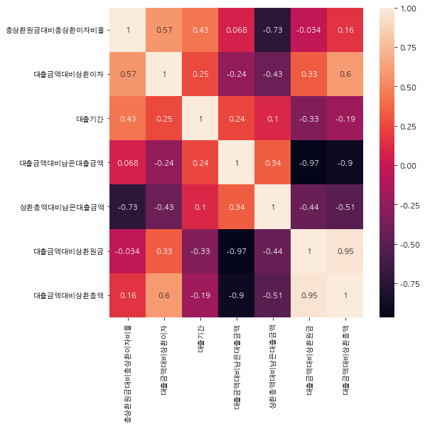
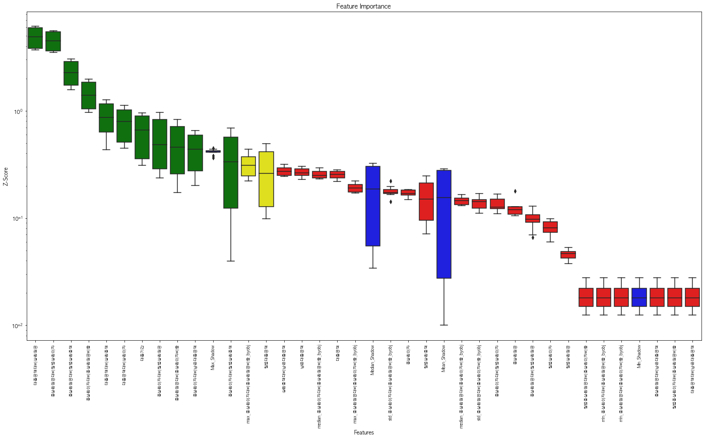
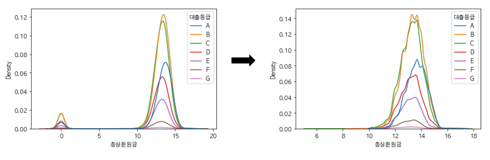
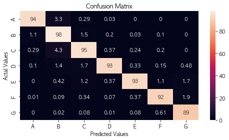
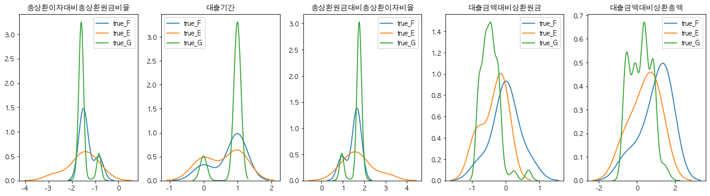
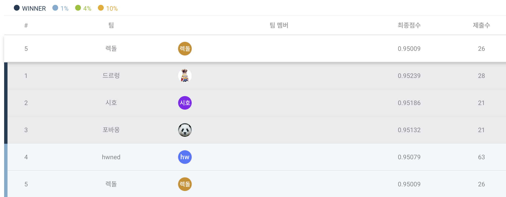

# 고객 대출등급 분류 AI 해커톤

## 프로젝트 개요

[대회 상세 페이지](https://dacon.io/competitions/official/236214/overview/description)

### 프로젝트 주제

대출 고객과 관련된 데이터 분석을 통해 고객의 대출등급 예측하는 AI 모델을 개발하는 것이 목적인 경진대회입니다.

### 활용 모듈

- Numpy, Pandas, Matplotlib, Seaborn, Sklearn, Imblearn
- XGBoost, LightGBM, CatBoost
- BorutaShap, Optuna

### 사용 데이터셋

- 학습 데이터 shape : 96294-rows, 15-columns
- 예측 데이터 shape : 64197-rows, 14-columns
- 예측해야하는 변수 : 대출등급
- 데이터 예시) 실제 데이터가 아닌 임의의 값으로 이뤄진 데이터입니다.

    | ID | 대출금액 | 대출기간 | 근로기간 | 주택소유상태 | 연간소득 | 부채_대비_소득_비율 | 총계좌수 | 대출목적 | 최근_2년간_연체_횟수 | 총상환원금 | 총상환이자 | 총연체금액 | 연체계좌수 | 대출등급 |
    | --- | --- | --- | --- | --- | --- | --- | --- | --- | --- | --- | --- | --- | --- | --- |
    | TRAIN_00000 | 12460000 | 60 months | 10+ years | RENT | 72000000 | 19.90 | 15 | 부채 통합 | 0 | 0 | 0.0 | 0.0 | 0.0 | C |
    | TRAIN_00001 | 14300000 | 36 months | <1 years | MORTGAGE | 130000000 | 22.33 | 21 | 주택 개선 | 0 | 373572 | 234070.0 | 0.0 | 0.0 | B |
    | TRAIN_00002 | 11000000 | 60 months | 6 years | MORTGAGE | 92000000 | 8.60 | 14 | 부채 통합 | 0 | 928644 | 151944.0 | 0.0 | 0.0 | A |
    

## 프로젝트 수행 절차

### 데이터 전처리

- Random / SMOTE / ADAYSN 기반의 리샘플링 알고리즘을 통해 클래스 불균형을 해결하려했습니다.
- EDA 와 Z-socre 를 활용한 전처리로 극단값과 특이값을 제거하여 표본공간을 축소했습니다.
    - 이상치 제거 후 분포 변화 시각화
        
        
        
- 통계 검정 및 편리한 시각화를 위해 왜도/첨도가 매우 큰 변수들에 대해 로그 변환을 수행하고 Shapiro-wilk 검정을 진행하며 분포를 정규화 했습니다.
    - 로그 변환을 통한 분포 변화 시각화
        
        
        
- 실험 결과 가장 성능이 좋았던 RobustScaler 를 활용하여 피처 스케일링을 진행했습니다.
- 이외에도 EDA를 통해 유효성을 만족하지 못한 데이터에 대한 전처리를 시행했습니다.
    - 전처리 예시
        
        ```python
        df["대출기간"] = df["대출기간"].apply(lambda x: int(x[1:3]) // 12)
        df["근로기간"] = df["근로기간"].replace({
                "1 year": "1 years",
                "10+years": "10+ years",
                "< 1 year": "<1 year",
                "3": "3 years"})
        
        replaced_duration = {}
        replaced_duration["<1 year"] = 1
        
        for i in range(1, 10):
            replaced_duration[f"{i} years"] = i + 1
        
        replaced_duration["10+ years"] = 11
        
        df["근로기간"] = df["근로기간"].replace(replaced_duration)
        ```
        

### 피처 엔지니어링

- 신용점수 산정에 있어 “상환이력”이 중요함을 확인하여 대출금액대비상환원금(총상환원금 / 대출금액) 변수를 생성하였고, 생성해낸 변수 중 가장 큰 성능 향상을 이끌어냈습니다.
- 대화형 인공지능 챗봇(Chat-GPT)을 활용하여 여러 유의미한 변수를 생성했습니다.
- Permutation Imporatnce / Shap Value 를 기반으로 한 변수 중요도를 통해 유의미한 파생변수를 선택했습니다.
- EDA 를 통해 범주형 변수 및 각종 통계량을 활용한 피처 엔지니어링을 시도했습니다.
- 상관성이 높은 연속형 변수들에 PCA 기법을 통한 차원축소를 진행하여 학습에 활용하려 했습니다.
    - 상관계수를 나타내는 히트맵
    
    
    
- Boruta 알고리즘 기반의 변수 선택 로직을 시도했습니다.
    - Boruta 알고리즘 기반의 변수 중요도 시각화
    
    
    

### 모델링

- 여러 유형의 모델에 대한 실험 이후, 예측 값들의 결과에 대한 Chi-sqaure 동질성 검정을 통해 동질적인 예측 양상을 띄는 모델을 가지치기해나갔습니다. 최종적으로 XGBoost 단일 모델로 최적의 성능을 이끌어냈습니다.
- EDA 결과 상환이력이 한번이라도 존재하는 고객들과 그렇지 않은 고객들간의 차이가 유의미하게 존재했습니다. 따라서 전체 약 94.6%의 상환이력이 존재하는 고객들에 대해서 별개의 모델을 적용하여 유의미한 성능 향상을 이끌어냈습니다.
    - 쌍봉우리를 이루는 분포를 정상화한 모습, 총상환원금 = 0 → 상환이력이 존재하지 않음을 의미
        
        
        
- Soft/Hard Voting 방식의 앙상블을 시도했습니다.
- XGBoost 의 학습 시 class weight 을 조절하여 불균형을 해결하려했습니다.
- Optuna 를 활용한 하이퍼파라미터 튜닝을 진행했습니다.
- Confusion Matrix 와 Mann-Whitney U 검정을 활용한 사후분석 결과 대출등급이 “G” 인 경우 “F” 와 “E”로 잘 못 예측하는 양상을 확인했습니다. 평가 metric 이 “Macro-F1” 이므로 소수의 클래스를 잘 예측하는 것이 중요하기 때문에 “G” 에 대한 Type2 Error 를 줄이기 위해 대출등급이 “G” 인 경우를 구분한 모델 개발을 시도했습니다.
    - Confusion Matrix 시각화
    
    
    
    - 실제 대출등급에 대한 각 변수의 분포 시각화
        
        
        

## 프로젝트 수행 결과



총 784개 팀 중 5위(상위 0.6%)를 달성했습니다.